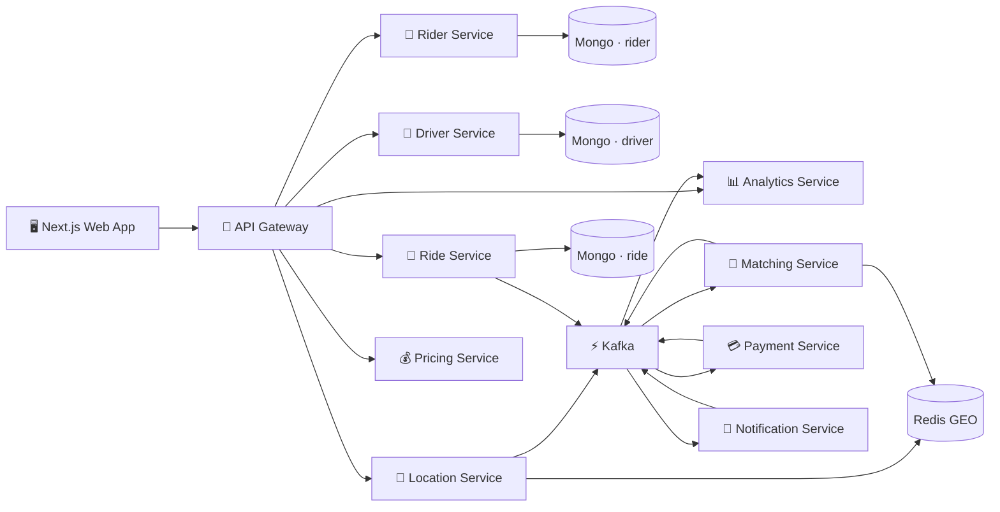

<div align="center">

# 🚖 Ride Booking Platform

**A production-grade, microservices-based ride booking platform built with the MERN stack**


*Real-time driver matching · Surge pricing · Kafka event streaming · Saga orchestration · Full observability*

</div>

---

## 📌 Overview

This platform is a full end-to-end ride booking system designed for scale. It covers the entire lifecycle of a ride — from rider signup and driver onboarding, through real-time GPS matching, dynamic surge pricing, payment processing, and push notifications — all wired together via Kafka event streams and orchestrated with the Saga pattern.

The stack replaces a traditional Java/Spring Boot monolith with a lean, horizontally scalable MERN microservices architecture:

| Original Stack | This Platform |
|---|---|
| Spring Boot services | Express.js microservices |
| Spring Security OAuth/JWT | JWT middleware + RBAC library |
| PostgreSQL per service | MongoDB database per service |
| Kafka Streams (JVM) | KafkaJS stream processors + Redis/Mongo state |
| JPA outbox pattern | Mongo outbox collection per service |
| Testcontainers | Docker Compose integration environment |

---

## 🏗️ Architecture



### Key Design Principles

- **Service isolation** — each service owns its own MongoDB collections; no cross-service DB reads
- **Event-driven** — all cross-service communication flows through Kafka domain events
- **Outbox pattern** — events written to a Mongo outbox collection before Kafka publish; zero message loss
- **Idempotent consumers** — Redis-backed event keys prevent duplicate processing
- **Saga orchestration** — the Ride Service coordinates multi-step workflows (match → book → pay → notify)
- **Horizontal scaling** — Kafka partitioned by aggregate ID, Redis GEO split by city

---

## 🧩 Services

| Service | Port | Responsibility |
|---|:---:|---|
| 🔐 **API Gateway** | 8080 | JWT auth, RBAC, rate limiting, request routing |
| 👤 **Rider Service** | 8101 | Rider identity, profile, ride history |
| 🚗 **Driver Service** | 8102 | Driver identity, verification, availability toggle |
| 📍 **Location Service** | 8103 | Real-time GPS ingestion, Redis GEO indexes |
| 🔎 **Matching Service** | 8104 | Nearest-driver matching and allocation |
| 🚖 **Ride Service** | 8105 | Ride lifecycle management and saga orchestration |
| 💰 **Pricing Service** | 8106 | Fare calculation, surge multipliers, reservation quotes |
| 💳 **Payment Service** | 8107 | Payment reservation, capture, refunds |
| 🔔 **Notification Service** | 8108 | Push, email, and SMS dispatch |
| 📊 **Analytics Service** | 8109 | Real-time metrics, KPIs, and projections |

---

## 📁 Project Structure

```
ride-booking-platform/
├── apps/
│   └── web/                        # Next.js 15 web app (rider, driver, admin portals)
│       ├── src/app/
│       │   ├── rider/              # Rider portal (book, track, history, payments)
│       │   ├── driver/             # Driver portal (dashboard, earnings, ratings)
│       │   └── admin/              # Admin panel (analytics, pricing, fleet management)
│       └── src/components/         # Shared UI components (shadcn/ui)
│
├── services/
│   ├── api-gateway/                # Auth, routing, rate limiting
│   ├── rider-service/              # Rider domain
│   ├── driver-service/             # Driver domain
│   ├── location-service/           # GPS + Redis GEO
│   ├── matching-service/           # Driver matching algorithm
│   ├── ride-service/               # Ride saga orchestrator
│   ├── pricing-service/            # Dynamic fare engine
│   ├── payment-service/            # Payments + refunds
│   ├── notification-service/       # Push / email / SMS
│   └── analytics-service/          # Metrics & projections
│
├── libs/
│   ├── common-events/              # Kafka topic names, schemas, publisher helpers
│   ├── common-security/            # JWT signing, RBAC middleware
│   ├── common-observability/       # Metrics, structured logging, OpenTelemetry tracing
│   └── common-utils/               # Express, Mongo, Redis, outbox, idempotency helpers
│
├── infrastructure/
│   ├── docker-compose.yml          # Kafka, Mongo, Redis, Prometheus, Grafana, Jaeger
│   ├── kafka/topics.sh             # Kafka topic provisioning script
│   ├── kubernetes/                 # K8s deployment + service manifests
│   └── monitoring/prometheus.yml   # Prometheus scrape config
│
├── docs/
│   ├── hld/high-level-design.md    # Architecture overview and design decisions
│   ├── lld/low-level-design.md     # Per-service detailed design
│   └── architecture/               # API contracts, event contracts, Kafka stream docs
│
├── .github/workflows/ci.yml        # GitHub Actions CI pipeline
├── Dockerfile                      # Multi-service Docker build
└── .env.example                    # Environment variable template
```

---

## ⚡ Tech Stack

| Layer | Technology |
|---|---|
| **Frontend** | Next.js 15, TypeScript, Tailwind CSS, shadcn/ui, Zustand |
| **Backend** | Node.js 22, Express.js, KafkaJS |
| **Databases** | MongoDB 7 (per-service), Redis (GEO + cache + idempotency) |
| **Messaging** | Apache Kafka (event streaming, outbox drain, saga events) |
| **Auth** | JWT (RS256), RBAC middleware |
| **Observability** | Prometheus, Grafana, Jaeger (OpenTelemetry), structured JSON logs |
| **Infrastructure** | Docker, Docker Compose, Kubernetes |
| **CI/CD** | GitHub Actions |

---

## 🚀 Getting Started

### Prerequisites

- Node.js 22+
- Docker & Docker Compose
- npm 10+

### 1. Clone & Install

```bash
git clone https://github.com/Aakashsharma614/Ride-Booking-Platform.git
cd Ride-Booking-Platform
npm install
```

### 2. Configure Environment

```bash
cp .env.example .env
```

Key variables in `.env`:

```env
NODE_ENV=development
JWT_SECRET=change-me
KAFKA_BROKERS=localhost:9092
MONGO_URI=mongodb://localhost:27017/ride_platform
REDIS_URL=redis://localhost:6379
OTEL_EXPORTER_OTLP_ENDPOINT=http://localhost:4318/v1/traces
API_GATEWAY_PORT=8080
```

### 3. Start Infrastructure

```bash
docker compose -f infrastructure/docker-compose.yml up -d kafka mongo redis prometheus grafana jaeger
```

### 4. Run Services

```bash
# Start API Gateway
npm run dev:gateway

# Start Web App
npm run dev:web
```

> Access the web app at `http://localhost:3000`  
> API Gateway at `http://localhost:8080`  
> Grafana dashboard at `http://localhost:3001`  
> Jaeger tracing UI at `http://localhost:16686`

---

## 🔄 How a Ride Works (Saga Flow)

```
Rider books ride
      │
      ▼
API Gateway ──► Ride Service (creates ride, publishes ride.requested)
      │
      ▼
Matching Service (finds nearest driver via Redis GEO, publishes driver.assigned)
      │
      ▼
Pricing Service (calculates fare, publishes fare.quoted)
      │
      ▼
Rider & Driver notified via Notification Service
      │
      ▼
Ride completes ──► Payment Service captures fare ──► Analytics updated
```

Each step publishes a Kafka event. On failure, compensating events trigger rollback (e.g. driver.released, payment.refunded).

---

## 📊 Observability

| Tool | Purpose | URL |
|---|---|---|
| Prometheus | Metrics scraping | `localhost:9090` |
| Grafana | Dashboards & alerting | `localhost:3001` |
| Jaeger | Distributed tracing | `localhost:16686` |
| Structured logs | JSON logs per service | stdout / log aggregator |

---

## 🧪 Testing & CI

```bash
npm test          # Run all tests
npm run build     # Build all packages
npm audit         # Security audit
```

The GitHub Actions pipeline on every push and PR:
1. Installs dependencies
2. Runs the test suite
3. Builds the project
4. Runs `npm audit --audit-level high`
5. Builds the Docker image

---

## 📖 Documentation

| Doc | Description |
|---|---|
| [High-Level Design](docs/hld/high-level-design.md) | Architecture, service boundaries, scalability and resiliency decisions |
| [Low-Level Design](docs/lld/low-level-design.md) | Per-service schemas, APIs, and internal design |
| [API Contracts](docs/architecture/api-contracts.md) | REST API specs for all services |
| [Event Contracts](docs/architecture/event-contracts.md) | Kafka topic and event schema definitions |
| [Kafka Streams](docs/architecture/kafka-streams.md) | Stream processor and aggregation design |

---

## 📜 License

MIT © [Aakashsharma614](https://github.com/Aakashsharma614)
