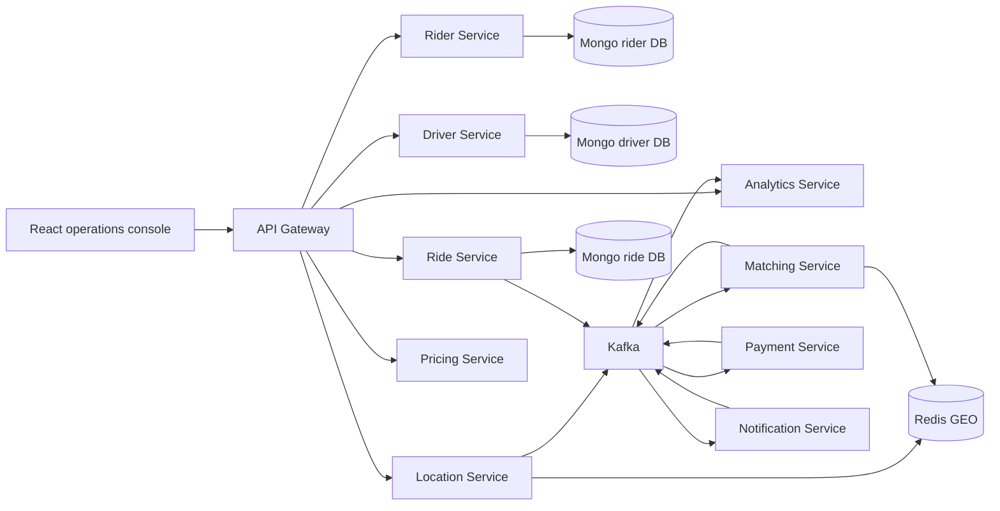

# High-Level Design

## Architecture

## Service Boundaries

Each service owns its collection set and exposes only domain APIs or domain events. Cross-service reads use events, CQRS projections, or API calls through the gateway. No service directly reads another service database.

## MERN Translation

The original Java requirements map to MERN as follows:

| Original concern | MERN implementation |
| --- | --- |
| Spring Boot services | Express microservices |
| Spring Security OAuth/JWT | JWT middleware and RBAC library |
| PostgreSQL per service | MongoDB database per service |
| Kafka Streams | KafkaJS stream processors with Redis/Mongo state stores |
| JPA outbox | Mongo outbox collection per service |
| Testcontainers | Docker Compose-backed integration environment |

## Scalability

Services scale horizontally behind Kubernetes services. Kafka partitions are keyed by aggregate ID for ordering within a ride, driver ID for driver events, and city ID where locality matters. Redis GEO indexes are split by city to keep nearby-driver lookups bounded.

## Resiliency

Events are written through an outbox, consumers are idempotent, retries use exponential backoff, failed publishes stay visible in Mongo, and Kafka dead-letter topics are provisioned for poison messages.

