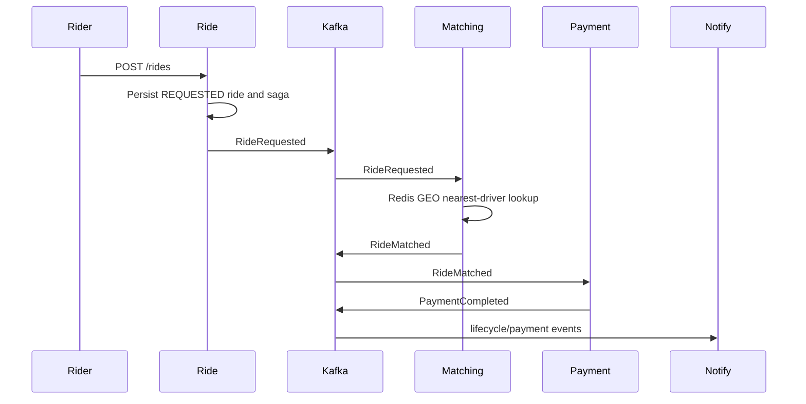
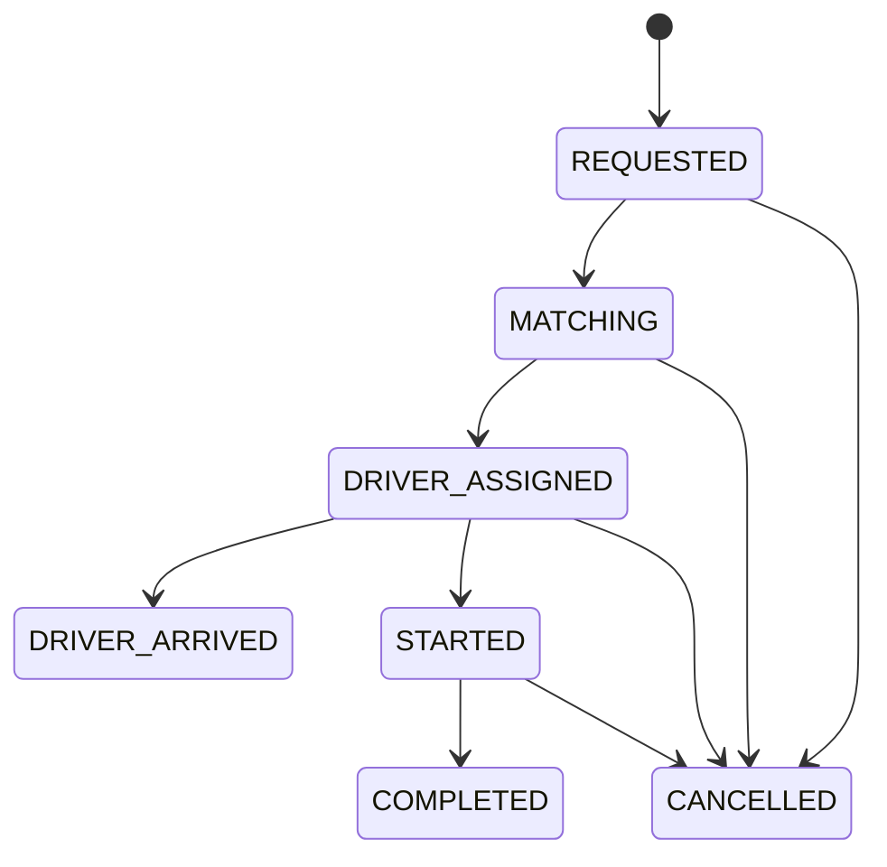

# Low-Level Design

## Ride Booking Saga

## State Transitions

## Mongo Ownership

| Service | Database | Core collections | Indexes |
| --- | --- | --- | --- |
| Rider | `ride_riders` | `riders`, `riderridehistories`, outbox | email unique, phone unique, riderId |
| Driver | `ride_drivers` | `drivers`, outbox | email unique, phone unique, cityId, availability, verificationStatus |
| Location | `ride_locations` | `locationsamples`, outbox | driverId, cityId, 2dsphere point |
| Matching | `ride_matching` | `matchattempts`, outbox | rideId, status |
| Ride | `ride_rides` | `rides`, `ridebookingsagas`, outbox | riderId, driverId, cityId, status |
| Pricing | `ride_pricing` | `quotes` | rideId unique, cityId |
| Payment | `ride_payments` | `payments`, outbox | rideId, riderId, status |
| Notification | `ride_notifications` | `notifications`, outbox | recipientId, status |
| Analytics | `ride_analytics` | `analyticsfacts` | eventId unique, eventType, aggregateId, cityId |

## Redis Keys

| Key | Purpose | TTL |
| --- | --- | --- |
| `geo:drivers:{cityId}` | Active driver coordinates | Managed by online/offline and location updates |
| `driver:{driverId}:location` | Hot driver location document | 120 seconds |
| `ride:{rideId}` | Hot ride lookup cache | 1 hour |
| `idempotency:event:{eventId}` | Consumer idempotency | 7 days after success |
| `city:{cityId}:open-ride-requests` | Surge input counter | Continuous |

## Compensation

If matching fails, the saga remains in a retryable matching state and the rider receives a notification. If payment fails after driver assignment, ride service emits RideCancelled and matching releases the driver back to the active pool.

